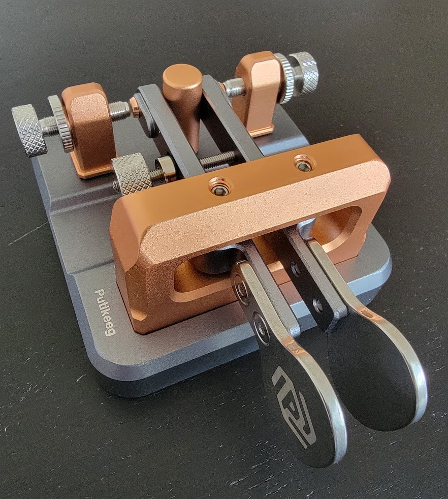
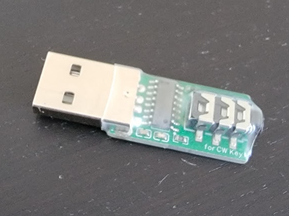

# Morse Trainer

A Morse code trainer written in Dart / Flutter, with support for a USB iambic
Morse key (USB id `413d:2107`).

## The program

The main window has a left column listing the parts of the program; click one to
open it:

- **About** — a description of the program and how it works.
- **Settings** — choose the paddle orientation, the keying speed (WPM), the
  side-tone volume and frequency, and the training character set. There is no
  input-device selection: the USB key and the keyboard paddles are both always
  active, and the key can be plugged in (or unplugged) at any time.
- **Input Train** — a character is shown; you key it in Morse and the trainer
  decodes what you send and tells you whether it was correct.
- **Listen Train** — the trainer plays a character as Morse audio; you type the
  character you heard.
- **Listen Tutorial** — a guided, 26-level listening course. Each level
  introduces one new letter (Koch-method order, easiest-to-distinguish sounds
  first): the letter is shown and its Morse is played, you type it to begin,
  then a random drill of every letter unlocked so far runs until each has been
  answered correctly three times. Completing a level unlocks the next; progress
  is remembered, and a dropdown lets you revisit any unlocked level.
- **Input Tutorial** — the same 26-level course with the roles reversed, to
  teach *sending*. Each level shows the new letter's dots and dashes with the
  letter beside them; key the pattern to begin. In practice the pattern is
  taken away — only the letter is shown — and you key its Morse from memory
  (USB paddle or keyboard, exactly as in Input Train) with a live display of
  what you are keying. A **Hear it** button plays the target's rhythm (it is
  disabled while you are keying, since the keyer owns the side-tone), and a
  per-letter hint reveals the pattern if you get stuck. Its progress is
  tracked separately from the Listen Tutorial — hearing a letter and keying
  it are different skills.

## The Hardware

The iambic keyer that I have used is the Putikeeg MCT II.

It is listed on Amazon as the "CW Key Morse Code Key Morse Telegraph Key Morse Code Key Aluminum Alloy CW Square-Shaped Base Red (Grey)"




[Keyer Amazon Link](https://www.amazon.com/dp/B0CQFVPRTR?ref=ppx_yo2ov_dt_b_fed_asin_title&th=1)

This provides a 3.5mm jack interface. To connect to a computer you need
a USB interface. The one I use is listed on Amazon as the "Morse Code Training Adapter USB Key Trainer for/Key Mobile Computer Support 3.5mmPlug Key Trainer Connectors"



[USB Interface Amazon Link](https://www.amazon.com/dp/B0DLVYYKDX?ref=ppx_yo2ov_dt_b_fed_asin_title&th=1)

## The USB Morse key

The key enumerates as a standard USB HID keyboard with the identifier 413d:2107. On Linux it is read directly
from its `/dev/hidrawN` node — no drivers needed. Each paddle is reported in the
HID modifier byte:

- Left-Ctrl bit (`0x01`) → one paddle
- Right-Ctrl bit (`0x10`) → the other paddle

The device sends raw paddle up/down state; a software **iambic keyer** turns
those presses into correctly-timed dits and dahs (squeeze both paddles for
alternating elements) and decodes them into characters. Which paddle is dit vs
dah is set in Settings ("Paddle orientation").

### Permissions

On MacOs:

When first run, you should be prompted to open the input monitoring section in 
the settings. Grant input monitoring to Morsey then close and reopen Morsey.

On linux:

You need read access to the key's `/dev/hidraw*` node. On this machine the node
is owned by group `plugdev` with an ACL, and the user is in `plugdev`, so it
works out of the box. If not, add a udev rule such as:

```
# /etc/udev/rules.d/99-morse-key.rules
SUBSYSTEM=="hidraw", ATTRS{idVendor}=="413d", ATTRS{idProduct}=="2107", MODE="0660", GROUP="plugdev"
```

then `sudo udevadm control --reload && sudo udevadm trigger`.

## Audio

Tones are synthesised in Dart and streamed to PulseAudio/PipeWire via `pacat`
(from `pulseaudio-utils`) — no gstreamer or extra Flutter audio plugin is
required. If no audio backend is found the app still runs (Input Train works
silently; Listen Train needs sound).

## Practising without the USB key

Nothing to configure — the keyboard paddles are always active alongside the
USB key. The Left-Arrow key is the dit paddle and the Right-Arrow key is the
dah paddle (`.`/`-` and Left/Right-Ctrl also work). Click the Input Train area
first so it has keyboard focus. If you plug the USB key in mid-session it
connects automatically.

## Running

```
flutter run -d linux
```

## Building

```
flutter build linux
```

## Tests

```
flutter test
```

Covers the Morse table, settings/timing, the app shell, and the iambic
keyer/decoder (driven by a simulated paddle).

## Layout

```
lib/
  main.dart                     app entry + main window / left nav column
  app_scope.dart                shared Settings + AudioEngine (InheritedWidget)
  models/settings.dart          settings model (input, speed, tone, char set)
  morsey/morse_code.dart        Morse alphabet + character sets
  morsey/iambic_keyer.dart      software iambic keyer + live decoder
  audio/audio_engine.dart       Dart tone synth streamed via pacat
  input/paddle_source.dart      paddle source abstraction
  input/hid_paddle_source.dart  reads the USB key (hidraw / IOKit), hotplugs
  input/keyboard_paddle_source.dart  keyboard keys as dit/dah paddles
  input/combined_paddle_source.dart  keyboard + USB key active together
  screens/                      About / Settings / Input Train / Listen Train /
                                Listen Tutorial / Input Tutorial
```
